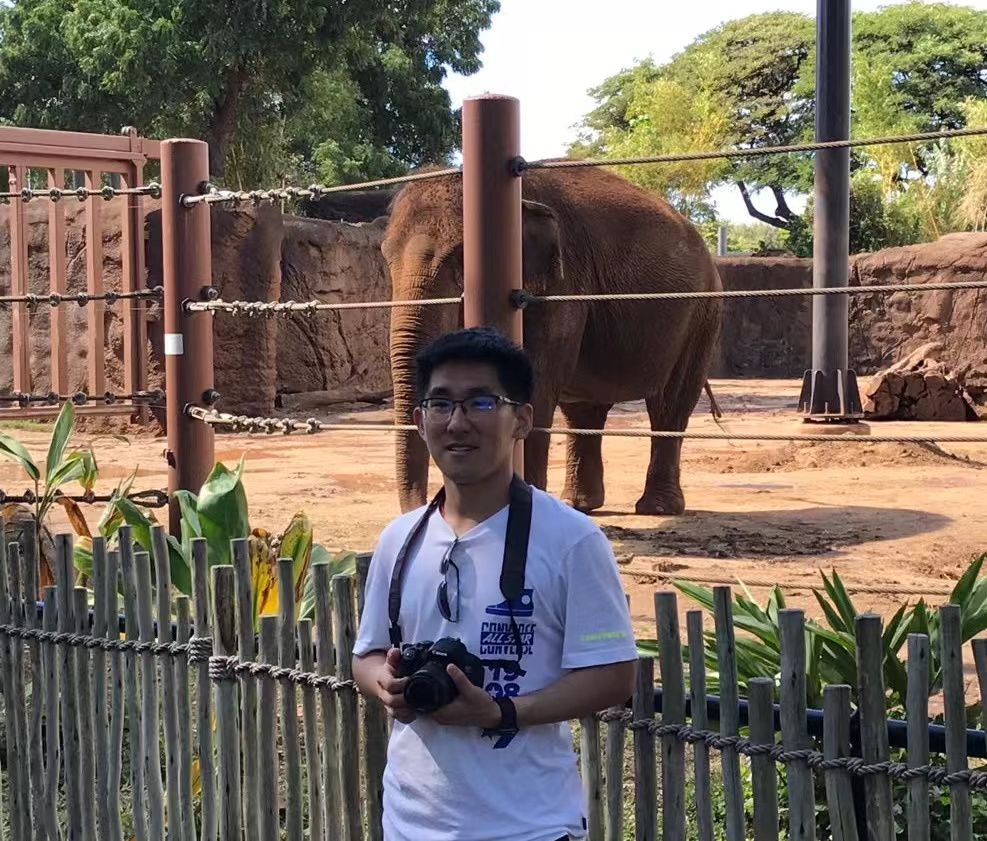

<table border="0">
  <tr>
    <td>
      <h1>Haichao Shi</h1>
      
<b>Ph.D candidate</b>

      
<b>Institute of Information Engineering, Chinese Academy of Sciences</b>

      
<b>E-mail：shihaichao@iie.ac.cn</b>

      
<b>Address：Beijing, Haidian District, Road Minzhuang, No.89</b>

      
<a href="https://dblp.org/pid/180/1745.html">DBLP</a>

      
<a href="https://scholar.google.com/citations?user=WvyvclcAAAAJ&hl=zh-CN">Google Scholar</a>

      <a href="index.html">中文版</a>
    </td>
    <td width="25%">
      
    </td>
  </tr>
</table>

Haichao Shi (Student Member, IEEE) received the B.S. degree in software engineering from Beijing Technology and Business University, Beijing, China, in 2017. I am currently pursuing the Ph.D. degree in cyberspace security with the National Engineering Laboratory of Information Content Security Technology, Institute of Information Engineering, Chinese Academy of Sciences, Beijing. My research interests include action detection, action recognition, re-identification, etc.

<h3>Publications</h3>
<ul>
<li>Weakly-Supervised Action Recognition and Localization via Iterative Optimization of Embedding and Modeling. Pattern Recognition, 2021.</li>
<li>AdapNet: Adaptability Decomposing Encoder-Decoder Network for Weakly Supervised Action Recognition and Localization. IEEE TNNLS, 2020.</li>
<li>Active semi-supervised learning based on self-expressive correlation with generative adversarial networks. Neurocomputing, 2019.</li>
<li>SAPS Self-Attentive Pathway Search for Weakly-supervised Action Localization with Background-Action Augmentation. Computer Vision and Image Understanding (CVIU), 2021.</li>
</ul>
<h3>Conferences</h3>
<ul>
<li>Multi-instance Multi-label Action Recognition and Localization Based on Spatio-Temporal Pre-trimming for Untrimmed Videos. The Thirty-Fourth AAAI Conference on Artificial Intelligence (AAAI), 2020.</li>
<li>Learning Transferable Self-attentive Representations for Action Recognition in Untrimmed Videos with Weak Supervision. The Thirty-Third AAAI Conference on Artificial Intelligence (AAAI), 2019.</li>
<li>SSGAN: Secure Steganography Based on Generative Adversarial Networks. Pacific-Rim Conference on Multimedia (PCM), 2017.</li>
<li>Flexible Non-Autoregressive Extractive Summarization with Threshold: How to Extract a Non-Fixed Number of Summary Sentences. The Thirty-Fifth AAAI Conference on Artificial Intelligence (AAAI), 2021.</li>
<li>DistilSum: Distilling the Knowledge for Extractive Summarization. The 29th ACM International Conference on Information and Knowledge Management (CIKM), 2020.</li>
<li>Image captioning based on deep reinforcement learning. Proceedings of the 10th International Conference on Internet Multimedia Computing and Service (ICIMCS), 2018.</li>
<li>Synchronized Detection and Recovery of Steganographic Messages with Adversarial Learning. INTERNATIONAL CONFERENCE ON COMPUTATIONAL SCIENCE (ICCS), 2019.</li>
<li>Weakly-Supervised Action Recognition and Localization via Knowledge Transfer. Chinese Conference on Pattern Recognition and Computer Vision (PRCV), 2019.</li>
<li>Weakly Supervised Action Recognition and Localization based on Twin Structured Transferable Self-attentive Representation. The 8th international conference on Computational Visual Media (CVM), 2020.</li>
</ul>
<h3>Honors and awards</h3>
<ul>
<li>The Winner of OmniCV Workshop Challenge, CVPR, 2021.</li>
<li>Pacemaker to Merit Student (Top 1%), University of Chinese Academy of Sciences. 2020.</li>
<li>Merit Student, University of Chinese Academy of Sciences. 2018, 2020.</li>
<li>National Scholarship, Ministry of Education, China 2019.</li>
<li>Merit Student, Beijing. 2017.</li>
</ul>

<h3>Competitions</h3>
<ul>
<li>CVPR 2021 OmniCV Workshop Challenge--Woodscape Fisheye Semantic Segmentation for Autonomous Driving, 2021.04--2021.06, First Prize.</li>
<li>CVPR 2021 UG2+ Challenge Track2.1—-Fully Supervised Action Recognition in the Dark, 2021.02--2021.05, Rank: 5.</li>
</ul>
<h3>Social work</h3>
<ul>
<li>2020.10, Conference Reviewer, Thirty-Fifth AAAI Conference on Artificial Intelligence (AAAI) 2021.</li>
<li>2020.12, Conference Reviewer, IEEE/CVF Conference on Computer Vision and Pattern Recognition 2021.</li>
<li>2019.11, Conference Reviewer, IEEE International Conference on Multimedia and Expo (ICME) 2019.</li>
<li>2019.5--2019.12, Journal Reviewer, IEEE Access.</li>
</ul>
