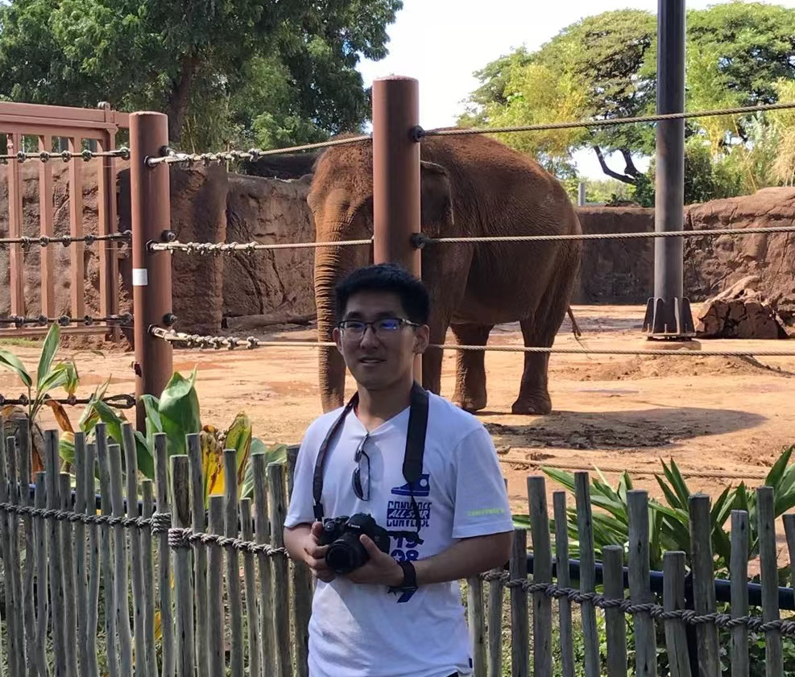

<table border="0">
  <tr>
    <td width="75%">
      <h1>石海超</h1>
      
<b>博士研究生</b>

      
<b>中国科学院信息工程研究所</b>

      
<b>邮箱：shihaichao@iie.ac.cn</b>

      
<b>地址：北京市海淀区闵庄路甲89号，邮编100093</b>

      
<a href="https://dblp.org/pid/180/1745.html">DBLP</a>

      
<a href="https://scholar.google.com/citations?user=WvyvclcAAAAJ&hl=zh-CN">Google Scholar</a>

      
<a href="/index-en.html">English Version</a>

    </td>
    <td width="25%">
      
    </td>
  </tr>
</table>

---

石海超，中国科学院信息工程研究所在读博士研究生。主要研究方向包括行为识别与检测等相关问题。

---

### 学术论文
<li>Weakly-Supervised Action Recognition and Localization via Iterative Optimization of Embedding and Modeling. Pattern Recognition, 2021.</li>
<li>AdapNet: Adaptability Decomposing Encoder-Decoder Network for Weakly Supervised Action Recognition and Localization. IEEE TNNLS, 2020.</li>
<li>Multi-instance Multi-label Action Recognition and Localization Based on Spatio-Temporal Pre-trimming for Untrimmed Videos. The Thirty-Fourth AAAI Conference on Artificial Intelligence (AAAI), 2020.</li>
<li>Learning Transferable Self-attentive Representations for Action Recognition in Untrimmed Videos with Weak Supervision. The Thirty-Third AAAI Conference on Artificial Intelligence (AAAI), 2019.</li>

<li>Active semi-supervised learning based on self-expressive correlation with generative adversarial networks. Neurocomputing, 2019.</li>

<li>SSGAN: Secure Steganography Based on Generative Adversarial Networks. Pacific-Rim Conference on Multimedia (PCM), 2017.</li>

<li>SAPS Self-Attentive Pathway Search for Weakly-supervised Action Localization with Background-Action Augmentation. Computer Vision and Image Understanding (CVIU), 2021.</li>

<li>Flexible Non-Autoregressive Extractive Summarization with Threshold: How to Extract a Non-Fixed Number of Summary Sentences. The Thirty-Fifth AAAI Conference on Artificial Intelligence (AAAI), 2021.</li>

<li>DistilSum: Distilling the Knowledge for Extractive Summarization. The 29th ACM International Conference on Information and Knowledge Management (CIKM), 2020.</li>

<li>Image captioning based on deep reinforcement learning. Proceedings of the 10th International Conference on Internet Multimedia Computing and Service (ICIMCS), 2018.</li>

<li>Synchronized Detection and Recovery of Steganographic Messages with Adversarial Learning. INTERNATIONAL CONFERENCE ON COMPUTATIONAL SCIENCE (ICCS), 2019.</li>

<li>Weakly-Supervised Action Recognition and Localization via Knowledge Transfer. Chinese Conference on Pattern Recognition and Computer Vision (PRCV), 2019.</li>

<li>Weakly Supervised Action Recognition and Localization based on Twin Structured Transferable Self-attentive Representation. The 8th international conference on Computational Visual Media (CVM), 2020.</li>

<!-- ### 研究方向
- 行为识别
- 行为检测 -->

### 社会工作
- 2020.10, Conference Reviewer, Thirty-Fifth AAAI Conference on Artificial Intelligence (AAAI) 2021.
- 2020.12, Conference Reviewer, IEEE/CVF Conference on Computer Vision and Pattern Recognition 2021.
- 2019.11, Conference Reviewer, IEEE International Conference on Multimedia and Expo (ICME) 2019.
- 2019.5--2019.12, Journal Reviewer, IEEE Access.

### 荣誉和奖励
<ul>
<li>三好学生标兵, 中国科学院大学. 2020.</li>
<li>三好学生, 中国科学院大学. 2018, 2020.</li>
<li>国家奖学金, 教育部, 2019.</li>
<li>三好学生, 北京市. 2017.</li>
</ul>

### 科研竞赛
<ul>
<li>CVPR 2021 OmniCV Workshop Challenge--Woodscape Fisheye Semantic Segmentation for Autonomous Driving, 2021.04--2021.06, 第一名.</li>
<li>CVPR 2021 UG2+ Challenge Track2.1—-Fully Supervised Action Recognition in the Dark, 2021.02--2021.05, 第五名.</li>
</ul>

<!-- ### 项目研究
- **专利**  -->

<!-- #### 公司/学校/研究所（2017.9~至今）
- **项目1**  
项目描述
- **项目2**  
项目描述
 -->
